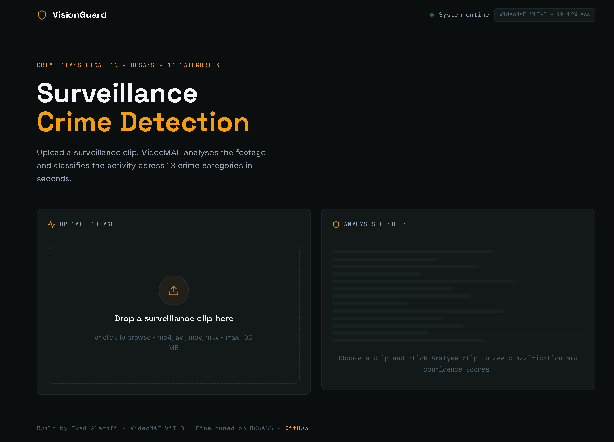

<div align="center">
  <br />
  
  <h1>VisionGuard</h1>
  <p><strong>Two-stage deep learning system for real-time crime classification in surveillance footage</strong></p>

  <p>
    
    
    
    
    
    
  </p>

  <br />

  

  <br /><br />

</div>

---

## What is VisionGuard?

VisionGuard analyses short surveillance video clips and classifies criminal activity across **13 crime categories** using a two-stage deep learning pipeline. Upload a clip — the system tells you in under 300ms whether the footage is normal or flags the specific type of crime.

Built as a portfolio project to demonstrate end-to-end ML engineering: dataset handling, model fine-tuning, production API design, and full-stack deployment.

<br />

## How the Pipeline Works

```
                        ┌─────────────────────────────────────────┐
  surveillance clip ──▶ │  STAGE 1  ·  X3D-S  ·  ~10ms           │
                        │  Binary classifier: Normal / Abnormal   │
                        └───────────────┬─────────────────────────┘
                                        │
                           ┌────────────┴────────────┐
                           ▼                         ▼
                        Normal                   Abnormal
                           │                         │
                     ✓  STOP                         │
                    (fast path)                       ▼
                                    ┌─────────────────────────────────────────┐
                                    │  STAGE 2  ·  VideoMAE ViT-B  ·  ~200ms  │
                                    │  13-class crime classification           │
                                    └─────────────────────────────────────────┘
```

**Why two stages?**
A single model trained only on crime footage would label *everything* as a crime — a person walking would be flagged as Stealing. Stage 1 solves this by learning from the per-clip binary labels already embedded in the DCSASS dataset (`0 = normal segment`, `1 = anomaly`). Normal clips exit immediately. Only genuinely suspicious clips trigger the heavier Stage 2.

<br />

## Results

### Stage 2 — VideoMAE ViT-B (13-class crime classifier)

> Trained on DCSASS · 16,639 clips · 20 epochs · Early stopping

| Class | Precision | Recall | F1 |
|:--|:--:|:--:|:--:|
| Abuse | 1.0000 | 1.0000 | **1.0000** |
| Arrest | 1.0000 | 0.9639 | **0.9816** |
| Arson | 0.9857 | 0.9857 | **0.9857** |
| Assault | 1.0000 | 1.0000 | **1.0000** |
| Burglary | 0.9934 | 1.0000 | **0.9967** |
| Explosion | 1.0000 | 0.9865 | **0.9932** |
| Fighting | 1.0000 | 1.0000 | **1.0000** |
| RoadAccidents | 0.9959 | 0.9959 | **0.9959** |
| Robbery | 1.0000 | 0.9881 | **0.9940** |
| Shooting | 0.9691 | 0.9792 | **0.9741** |
| Shoplifting | 0.9783 | 1.0000 | **0.9890** |
| Stealing | 0.9809 | 1.0000 | **0.9903** |
| Vandalism | 0.9785 | 0.9785 | **0.9785** |
| | | | |
| **Weighted avg** | **0.9917** | **0.9916** | **0.9916** |

<br />

## Tech Stack

| Layer | Technology | Role |
|:--|:--|:--|
| **Stage 1** | X3D-S · torchvision · 3.8M params | Binary anomaly gate |
| **Stage 2** | VideoMAE ViT-B · HuggingFace · 86M params | 13-class crime classifier |
| **Pretraining** | Kinetics-400 | Both models pretrained here |
| **Dataset** | DCSASS · 16,639 clips · 13 classes | Fine-tuning target |
| **Video I/O** | Decord | H.264 decode on Windows |
| **Backend** | FastAPI + Uvicorn | REST API |
| **Frontend** | React 18 + Vite | UI |
| **Config** | YAML + Pydantic + python-dotenv | Typed config system |
| **GPU** | NVIDIA RTX 5060 Ti (Blackwell sm_120) | Training hardware |
| **CUDA** | PyTorch Nightly + CUDA 12.8 | Blackwell support |

<br />

## Project Structure

```
crime-vision/
│
├── configs/
│   └── config.yaml              ← single source of truth for all hyperparameters
│
├── src/
│   └── config.py                ← Pydantic loader with env-var interpolation
│
├── training/
│   ├── dataset.py               ← DCSASS VideoDataset, Decord loader, augmentations
│   ├── model.py                 ← VideoMAE ViT-B + 13-class classification head
│   ├── train.py                 ← Stage 2 training loop, gradual unfreeze, TensorBoard
│   ├── evaluate.py              ← per-class report, confusion matrix export
│   ├── binary_dataset.py        ← CSV label parser → Normal / Abnormal dataset
│   ├── binary_model.py          ← X3D-S binary classifier
│   └── train_binary.py          ← Stage 1 training loop
│
├── backend/
│   └── app/
│       ├── main.py              ← FastAPI app, routes, CORS
│       ├── inference.py         ← TwoStagePipeline, frame extraction
│       └── schemas.py           ← Pydantic request / response models
│
├── frontend/
│   └── src/
│       ├── App.jsx              ← layout, header, hero
│       ├── index.css            ← dark forensic amber theme, animations
│       ├── components/
│       │   ├── UploadZone.jsx   ← drag-drop upload, scan line animation
│       │   └── ResultPanel.jsx  ← normal / abnormal verdict, confidence bars
│       └── hooks/
│           └── usePredict.js    ← API call, loading state, error handling
│
├── checkpoints/                 ← auto-created by training
│   ├── best_model.pth           ← Stage 2 VideoMAE weights
│   └── binary_best.pth          ← Stage 1 X3D-S weights
│
├── logs/                        ← TensorBoard logs, auto-created
├── .env.example                 ← template — copy to .env and fill in
├── .gitignore
└── requirements.txt
```

<br />

## Setup

### Prerequisites

- Python 3.11+
- Node.js 18+
- NVIDIA GPU (CUDA 12.1+ recommended, CUDA 12.8 required for RTX 50 series)
- DCSASS dataset

### 1 — Clone the repository

```bash
git clone https://github.com/00ed/crime-vision.git
cd crime-vision
```

### 2 — Create virtual environment

```bash
python -m venv venv

# Windows
venv\Scripts\activate

# macOS / Linux
source venv/bin/activate
```

### 3 — Configure environment variables

```bash
# Windows
copy .env.example .env
```

Open `.env` and fill in your values:

```env
# Path to the DCSASS Dataset folder on your machine
DCSASS_PATH=E:/Datasets/DCSASS Dataset

# HuggingFace token (required to download VideoMAE weights)
HF_TOKEN=hf_xxxxxxxxxxxxxxxxxxxxxxxx
```

### 4 — Install Python dependencies

```bash
pip install -r requirements.txt
```

### 5 — Install frontend dependencies

```bash
cd frontend
npm install
cd ..
```

<br />

## Training

All commands from the **project root**.

```bash
# ── Stage 2: VideoMAE 13-class crime classifier ──────────────────────────────
python training/train.py
# → saves checkpoints/best_model.pth

# ── Evaluate Stage 2 ─────────────────────────────────────────────────────────
python training/evaluate.py
# → saves checkpoints/confusion_matrix.png
# → saves checkpoints/evaluation_results.json

# ── Stage 1: X3D-S binary gate ───────────────────────────────────────────────
python training/train_binary.py
# → saves checkpoints/binary_best.pth

# ── Monitor training with TensorBoard (optional) ─────────────────────────────
tensorboard --logdir logs
```

> **Training time:** Stage 2 took ~20 epochs (~18 hours) on an RTX 5060 Ti.  
> Stage 1 is significantly faster — X3D-S is 22× smaller than VideoMAE.

<br />

## Running the System

You need **two terminals** running simultaneously.

**Terminal 1 — Backend API:**
```bash
uvicorn backend.app.main:app --reload --port 8000
```

Wait until you see:
```
Two-stage pipeline ready on cuda
  Stage 1: X3D-S binary  (threshold=0.5)
  Stage 2: VideoMAE ViT-B 13-class
Application startup complete.
```

**Terminal 2 — Frontend:**
```bash
cd frontend
npm run dev
```

Open **[http://localhost:5173](http://localhost:5173)** in your browser.

<br />

## API Reference

Base URL: `http://localhost:8000`

| Method | Endpoint | Description |
|:--|:--|:--|
| `GET` | `/health` | System status, loaded models, class list |
| `POST` | `/predict` | Upload a video file → two-stage prediction |
| `GET` | `/docs` | Interactive Swagger UI |

**POST `/predict` — example response (abnormal clip):**
```json
{
  "is_normal": false,
  "stage1_confidence": 0.9231,
  "top_prediction": "Robbery",
  "confidence": 0.9876,
  "all_scores": [
    { "label": "Robbery",  "confidence": 0.9876 },
    { "label": "Assault",  "confidence": 0.0071 },
    { "label": "Fighting", "confidence": 0.0024 }
  ],
  "inference_ms": 218.4,
  "stage1_ms": 11.2,
  "stage2_ms": 207.2
}
```

**POST `/predict` — example response (normal clip):**
```json
{
  "is_normal": true,
  "stage1_confidence": 0.9714,
  "top_prediction": null,
  "confidence": null,
  "all_scores": null,
  "inference_ms": 11.2,
  "stage1_ms": 11.2,
  "stage2_ms": null
}
```

<br />

## Configuration

All hyperparameters are in `configs/config.yaml` — no hardcoded values anywhere in source files.

Key settings:

```yaml
binary:
  abnormal_threshold: 0.5    # ↓ lower = more sensitive (fewer missed crimes)

training:
  batch_size: 4              # reduce to 2 if VRAM < 12 GB
  warmup_epochs: 3           # epochs with frozen encoder
  unfreeze_layers: 4         # ViT blocks to unfreeze after warmup
  patience: 7                # early stopping patience
```

<br />

## Dataset

**DCSASS** — Distributed Computing and Surveillance System dataset.

- **16,639** short surveillance clips (3–5 seconds each)
- **13 crime categories:** Abuse · Arrest · Arson · Assault · Burglary · Explosion · Fighting · RoadAccidents · Robbery · Shooting · Shoplifting · Stealing · Vandalism
- **Labels folder:** 13 CSV files with per-clip binary labels (`0` = normal, `1` = anomaly) used to train the Stage 1 gate

Each original surveillance video was pre-segmented into short clips stored in sub-folders. The binary labels in the CSVs directly correspond to whether a given clip segment contains criminal activity.

<br />

## Known Limitations

- **Clip-level evaluation:** Train/test split was done at the clip level, not the original video level. Clips from the same source video may appear in both sets, which inflates accuracy. True generalization requires video-level splitting.
- **Domain gap:** The model was trained exclusively on DCSASS. Performance on other surveillance datasets (e.g. UCF-Crime, ShanghaiTech) has not been evaluated.
- **Short clips only:** The pipeline samples 16 frames per clip. Very long continuous videos should be split into short segments before inference.

<br />

## Author

**Eyad Alatifi**

[](https://github.com/00ed)
[](https://linkedin.com/in/eyad-alatifi)
[](mailto:eyad.alatifi@gmail.com)

<br />

---

<div align="center">
  <sub>Built with PyTorch · VideoMAE · X3D · FastAPI · React</sub>
</div>
